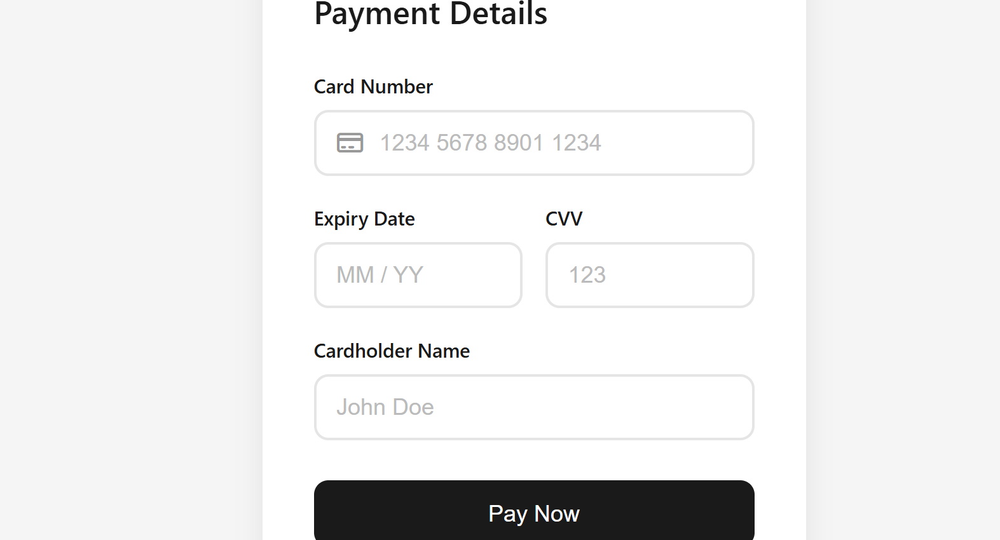

# 💳 Credit Card Formatter

A responsive Credit Card Payment Form built using HTML, CSS, and JavaScript. It provides a clean and user-friendly interface for entering card details with real-time formatting and basic client-side validation.

## ✨ Features

- 💳 Card number formatting
- 📅 Expiry date input (MM/YY)
- 🔒 CVV field
- 👤 Cardholder name input
- ✅ Payment success popup
- 📱 Responsive design
- 🎨 Modern and clean UI

## 🛠️ Technologies Used

- HTML5
- CSS3
- JavaScript (ES6)

## 🚀 How to Run

1. Download or clone the repository.
2. Open the project folder.
3. Open `index.html` in your browser.

## 📂 Project Structure

```
credit-card-formatter/
│── index.html
│── style.css
│── script.js
│── README.md
│── Screenshot.png
```

## 📸 Screenshot




## 👩‍💻 Author

**Jahnavi Ramawat**

GitHub: https://github.com/jahnavijain29-bit
